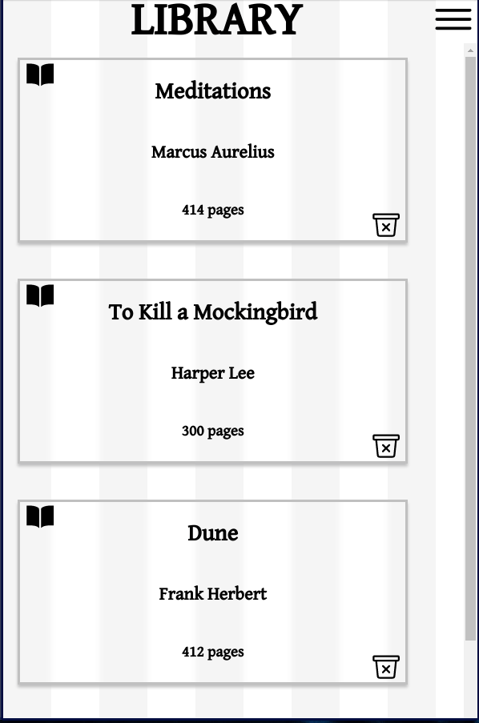

# Library catalog application using Vanilla Javascript and CSS 
https://nilryan.github.io/library/  
!  
     !

## Learning Outcomes:
  1. HTML form validation
  2. css layout and positioning
  3. responsive layout
  4. javascript classes, constructors, array methods
  5. web API local storage and JSON
