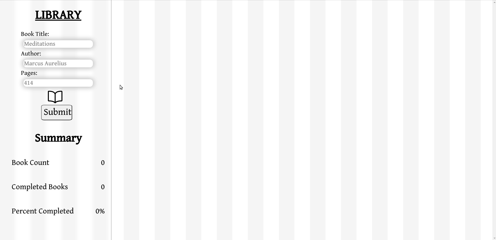

# Library catalog application using Vanilla Javascript and CSS 
A web application built using JS, HTML and CSS. The app functionality includes adding books with Title, Author, Pages as data displayed in a card like component. Books can be marked as read / unread and a tracker is included to determine total number of books, completed books and percentage of books completed. Mobile responsiveness was implemented using css flexbox and grid. Media queries were also added at breakpoints. 

Data is stored using local storage API.

https://nilryan.github.io/library/  
!  
     !

## Learning Outcomes:
  1. HTML form validation
  2. css layout and positioning
  3. responsive layout
  4. javascript classes, constructors, array methods
  5. web API local storage and JSON
